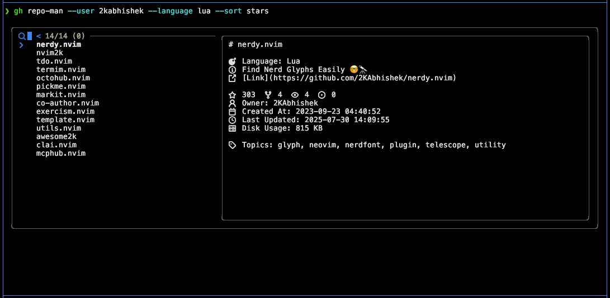

<div align = "center">

<h1><a href="https://github.com/2kabhishek/gh-repo-man">gh-repo-man</a></h1>

<a href="https://github.com/2KAbhishek/gh-repo-man/blob/main/LICENSE">
 </a>

<a href="https://github.com/2KAbhishek/gh-repo-man/graphs/contributors">
 </a>

<a href="https://github.com/2KAbhishek/gh-repo-man/stargazers">
</a>

<a href="https://github.com/2KAbhishek/gh-repo-man/network/members">
 </a>

<a href="https://github.com/2KAbhishek/gh-repo-man/watchers">
 </a>

<a href="https://github.com/2KAbhishek/gh-repo-man/pulse">
 </a>

<h3>Manage GitHub Repositories with Ease 📦🚀</h3>

<figure>
  
  <br/>
  <figcaption>gh-repo-man in action</figcaption>
</figure>

</div>

gh-repo-man is a GitHub CLI extension that allows developers to browse, clone, and work with multiple repositories interactively.

## ✨ Features

- Browse and clone GitHub repositories interactively using fuzzy finder (fzf) with live preview.
- Filter repositories by language, type (archived, forked, private, template), and sort by various criteria.
- Clone multiple repositories concurrently with configurable performance limits and progress indicators.
- Seamless integration with [tmux-tea](https://github.com/2kabhishek/tmux-tea) and editors for instant workspace setup after cloning.
- Smart caching system with configurable TTL to minimize API calls and improve performance.
- Fully customizable icons and UI elements with hierarchical YAML configuration support.
- Comprehensive repository details including stars, forks, issues, languages, and README preview.

## ⚡ Setup

### ⚙️ Requirements

- `gh` CLI >= 2.0.0
- `fzf` for interactive browsing
- Go >= 1.19 (for building from source)

### 💻 Installation

#### Via GitHub CLI Extensions

```bash
gh extension install 2KAbhishek/gh-repo-man
gh repo-man [flags]
```

#### From Source

```bash
git clone https://github.com/2KAbhishek/gh-repo-man
cd gh-repo-man
go build -o gh-repo-man main.go
gh extension install .
gh repo-man [flags]
```

## ⚙️ Configuration

gh-repo-man uses a YAML configuration file at `~/.config/gh-repo-man/config.yml` (or specify custom path with `--config`).

See [`example-config.yml`](./example-config.yml) for comprehensive configuration options with detailed comments covering repository settings, UI customization, performance tuning, and integrations.

## 🚀 Usage

The tool can be used in two ways:

```bash
### As a GitHub CLI Extension (Recommended)
gh repo-man [flags]
### As a Standalone Binary
gh-repo-man [flags]
```

### Flags

```
  -c, --config string     Path to configuration file
  -d, --dir string        Directory where repositories will be cloned (overrides config)
  -h, --help              Help for repo-man
  -l, --language string   Filter by primary language
  -r, --refresh           Force refresh repositories from GitHub, bypassing cache
  -s, --sort string       Sort repositories by (created, forks, issues, language, name, pushed, size, stars, updated)
  -t, --type string       Filter by repository type (archived, forked, private, template)
  -u, --user string       Browse repositories for a specific user
```

### Examples

```bash
# Browse your own repositories (as gh extension)
gh repo-man

# Browse your own repositories (standalone)
gh-repo-man

# Browse another user's repositories
gh repo-man --user torvalds

# Force refresh repositories from GitHub, bypassing cache
gh repo-man --refresh

# Filter by language and sort by stars
gh repo-man --language go --sort stars

# Browse private repositories only
gh repo-man --type private

# Use custom config file
gh repo-man --config ~/my-config.yml

# Clone to current directory
gh repo-man --dir .

# Clone to a specific directory
gh repo-man --dir ~/workspace/projects
```

### Navigation

- Use arrow keys to navigate through repositories
- Press `Tab` or `Shift+Tab` to select multiple repositories
- Press `Ctrl+r` to refresh the repository list live from GitHub
- Press `Enter` to clone selected repositories
- View repository details in the preview pane

## 🏗️ What's Next

Planning to add repository management features like creating, archiving, and updating repositories.

### ✅ To-Do

You tell me! Open an issue or PR with your ideas.

## 🧑‍💻 Behind The Code

### 🌈 Inspiration

gh-repo-man was inspired by [octohub.nvim](https://github.com/2kabhishek/octohub.nvim), I wanted to create a standalone CLI tool that could be used independently of Neovim, while still providing a similar interactive experience for managing GitHub repositories.

### 💡 Challenges/Learnings

- The main challenges were implementing proper context cancellation for concurrent operations and handling GitHub API rate limits
- I learned about Go's context package, concurrent programming patterns, and effective CLI tool design

### 🧰 Tooling

- [dots2k](https://github.com/2kabhishek/dots2k) — Dev Environment
- [nvim2k](https://github.com/2kabhishek/nvim2k) — Personalized Editor
- [sway2k](https://github.com/2kabhishek/sway2k) — Desktop Environment
- [qute2k](https://github.com/2kabhishek/qute2k) — Personalized Browser

### 🔍 More Info

- [GitHub CLI](https://github.com/cli/cli) — GitHub's official CLI tool
- [fzf](https://github.com/junegunn/fzf) — Command-line fuzzy finder
- [Cobra](https://github.com/spf13/cobra) — CLI framework for Go

<hr>

<div align="center">

<strong>⭐ hit the star button if you found this useful ⭐</strong><br>

<a href="https://github.com/2KAbhishek/gh-repo-man">Source</a>
| <a href="https://2kabhishek.github.io/blog" target="_blank">Blog </a>
| <a href="https://twitter.com/2kabhishek" target="_blank">Twitter </a>
| <a href="https://linkedin.com/in/2kabhishek" target="_blank">LinkedIn </a>
| <a href="https://2kabhishek.github.io/links" target="_blank">More Links </a>
| <a href="https://2kabhishek.github.io/projects" target="_blank">Other Projects </a>

</div>
